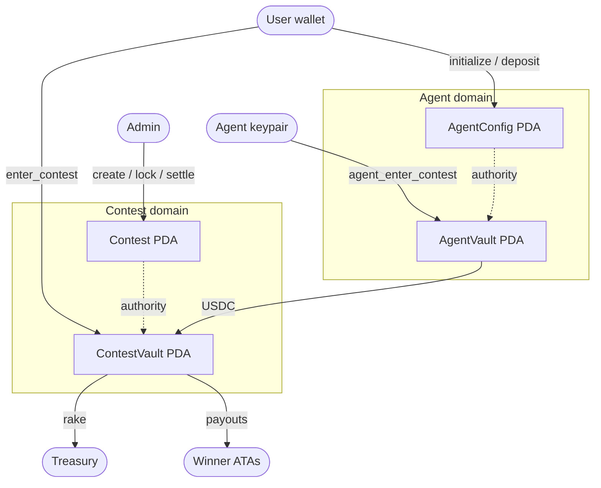

# MatchDay — World Cup Prediction Game

**Predict World Cup matches. Stake your confidence. Win USDC on Solana.**

MatchDay is a real-money prediction game for the 2026 FIFA World Cup. Users make match predictions (result, correct score, BTTS, over/under), set confidence multipliers that amplify risk and reward, and compete on live leaderboards. Winners are paid in USDC from an on-chain escrow — no custodial risk, no trust required.

An autonomous AI agent evaluates contests, builds its own predictions with reasoning, and competes alongside human players.

🌐 **Live App:** [matchday-predict.netlify.app](https://matchday-predict.netlify.app)
📹 **Demo Video:** [https://youtu.be/iSyHbAGagw8]

---

## What Makes This Different

**Confidence multipliers.** Every prediction has a 1×/2×/3× confidence toggle. A correct 3× prediction earns triple points. A wrong one costs you points. This turns prediction games from guessing into strategy — users have to manage risk across an entire matchday.

**Real money, trustless settlement.** Entry fees and prizes are USDC on Solana, held in a program-controlled escrow vault. No centralized custody. Settlement is deterministic — the scoring engine reads the final score, ranks entries, and the Anchor program distributes winnings.

**AI agent that competes.** The autonomous agent evaluates open contests, analyzes fixtures, builds predictions with per-pick confidence and reasoning, pays its own entry fee from a funded vault, and submits. Its reasoning is visible in the activity log — users can see why the agent predicted Brazil 2-1 and decided to put 3× confidence on the correct score.

**Live prediction resolution.** During matches, scores stream from TxLINE via SSE. The entry detail page updates in real time — predictions flip from "pending" to "correct" or "wrong" the moment the match ends, with points recalculated instantly.

---

## Architecture

```
matchday/
├── server/          Node.js + Express + PostgreSQL
│   ├── src/
│   │   ├── routes/          REST API endpoints
│   │   ├── services/        Business logic + AI agent
│   │   ├── queries/         PgTyped SQL (.sql → generated .ts)
│   │   ├── solana/          Anchor program client + PDA helpers
│   │   └── lib/             TxLINE client, SSE, cron
│   └── migrations/          Database schema
│
├── ui/              Next.js 14 + Tailwind + shadcn/ui
│   ├── app/                 Pages (App Router)
│   ├── components/          UI components
│   ├── hooks/               React hooks (data, auth, predictions, live scores)
│   └── lib/                 API client, Solana helpers, utils
│
└── anchor/          Shared IDL + types for the Solana program
```

---

### On-Chain Architecture



### Data Flow

```
TxLINE SSE stream
    ↓
SSE Service (server) → updates fixture scores in PostgreSQL
    ↓
Scoring Service → recalculates prediction points + leaderboard ranks
    ↓
SSE Endpoint (/live/scores) → pushes updates to connected frontends
    ↓
Entry Detail Page → predictions resolve in real time
```

### On-Chain Flow

```
User signs enter_contest tx → USDC transferred to contest vault PDA
    ↓
Backend verifies EntryReceipt PDA exists → creates entry + predictions in DB
    ↓
After all fixtures finish → admin triggers scoring + settlement
    ↓
settle_contest instruction → USDC distributed from vault to winner wallets
```

---

## Tech Stack

| Layer | Technology |
|---|---|
| Frontend | Next.js, React, Tailwind CSS, shadcn/ui |
| Backend | Node.js, Express, TypeScript |
| Database | PostgreSQL, PgTyped (type-safe SQL) |
| Blockchain | Solana, Anchor, USDC (SPL Token) |
| Auth | Privy (embedded Solana wallets) |
| AI Assistant | Anthropic Claude (Haiku) with tool-use |
| AI Agent | Anthropic Claude (Haiku) — autonomous predictions |
| Sports Data | TxLINE by TxODDS (real-time scores + odds via SSE) |
| Deployment | Railway (server), Vercel (frontend) |

---

## Prediction Types & Scoring

| Prediction | Base Points | Description |
|---|---|---|
| Match Result | 3 pts | Home win, draw, or away win |
| Correct Score | 5 pts | Exact final score (e.g., 2-1) |
| Both Teams Score | 2 pts | Will both teams score at least one goal? |
| Over/Under 2.5 | 2 pts | Total goals over or under 2.5 |

### Confidence Multipliers

| Multiplier | If Correct | If Wrong |
|---|---|---|
| 1× (Safe) | Base points | 0 |
| 2× (Double) | 2× base points | −1 point |
| 3× (Triple) | 3× base points | −2 points |

A user who puts 3× on Correct Score and gets it right earns **15 points**. Wrong = **−2 points**. This risk/reward system creates genuine strategic depth.

---

## Key Features

### For Users
- Browse World Cup contests and fixtures
- Make predictions with confidence multipliers
- Pay entry fees in USDC via embedded Solana wallet
- Watch predictions resolve live during matches
- Track rank on real-time leaderboards
- Chat with AI assistant for prediction advice

### For the AI Agent
- Evaluates open contests autonomously
- Analyzes fixtures and generates predictions with per-pick reasoning
- Manages its own USDC vault for entry fees
- Respects configurable budget limits and rules
- Full audit trail of decisions visible to the user

### Technical Highlights
- TxLINE SSE integration for real-time score updates
- PgTyped for fully type-safe database queries
- Privy embedded wallets — no browser extension required
- On-chain contest escrow with trustless settlement
- Confidence-weighted scoring with negative penalty system

---

## TxLINE Integration

MatchDay uses TxLINE as its sole source of live match data.

### Endpoints Used

| Endpoint | Purpose |
|---|---|
| `GET /api/fixtures/snapshot` | Fetch all World Cup fixtures (teams, kickoff times, groups) |
| `GET /api/scores/snapshot/{fixtureId}` | Get current score state for a fixture |
| `GET /api/scores/updates/{fixtureId}` | Poll for score updates |
| `GET /api/scores/historical/{fixtureId}` | Fetch completed match data for scoring |
| `GET /api/scores/stat-validation` | Merkle proof verification for score integrity |
| `GET /api/odds/snapshot/{fixtureId}` | Betting odds used by AI agent for confidence calibration |
| `SSE /api/scores/stream` | Real-time score stream — powers live prediction resolution |
| `SSE /api/odds/stream` | Real-time odds stream |

### How TxLINE Powers the Product

**Fixture sync:** A cron job polls TxLINE's fixture snapshot and syncs to PostgreSQL. This populates the contest creation flow — each contest references a set of TxLINE fixtures.

**Live scoring:** During matches, the server connects to TxLINE's SSE score stream. Score updates trigger immediate rescoring of all affected contests and push updates to connected frontends via our own SSE endpoint. Users see predictions flip from "pending" to "correct/wrong" in real time.

**AI agent analysis:** The agent receives fixture data (including odds where available) as context when building predictions. TxLINE odds inform the agent's confidence calibration — identifying value picks where its prediction diverges from market consensus.

**Score verification:** TxLINE's Merkle proof system (`stat-validation` endpoint) provides cryptographic verification of score data, enabling trustless on-chain settlement.

---

## Monetization Path

- **Rake on contest entry fees** — configurable per contest (default 10%), collected automatically at settlement into the platform treasury
- **Premium AI agent features** — advanced prediction strategies, higher contest limits, priority vault funding
- **Sponsored contests** — brands fund prize pools for branded prediction contests during major tournaments
- **Expansion beyond World Cup** — the architecture is competition-agnostic; Champions League, Premier League, and other TxLINE-supported leagues can be added with zero code changes

---

## Running Locally

### Prerequisites
- Node.js 18+
- PostgreSQL
- Solana CLI (for keypair generation)

### Server

```bash
cd server
npm install
createdb matchday
psql matchday < migrations/001_initial.sql
cp .env.example .env    # Fill in your values
npm run pgtyped         # Generate typed queries
npm run dev
```

### Frontend

```bash
cd ui
npm install
cp .env.example .env    # Fill in NEXT_PUBLIC values
npm run dev
```

### Environment Variables

**Server (.env)**
```
DATABASE_URL=postgres://user@localhost:5432/matchday
ANTHROPIC_API_KEY=sk-ant-...
HELIUS_API_KEY=...
ADMIN_KEYPAIR_JSON=[...]
AGENT_KEYPAIR_JSON=[...]
ADMIN_API_KEY=...
PRIVY_APP_ID=...
PRIVY_APP_SECRET=...
TXLINE_BASE_URL=https://txline.txodds.com
TXLINE_JWT=...
TXLINE_API_TOKEN=...
```

**Frontend (.env)**
```
NEXT_PUBLIC_API_URL=http://localhost:3001
NEXT_PUBLIC_PRIVY_APP_ID=...
NEXT_PUBLIC_SOLANA_RPC_URL=...
NEXT_PUBLIC_PROGRAM_ID=EwTXRAQrnm4BasdA5UCabHqpeodjAES3ok8D4LCg6Xt8
NEXT_PUBLIC_USDC_MINT=...
```

---

## Hackathon

Built for the **Global AI Hackathon 2026** — Consumer & Fan Experiences track.

**Data Source:** TxLINE by TxODDS — real-time World Cup scores and odds delivered via SSE with cryptographic verification (Merkle proofs on Solana).

---

## License

MIT