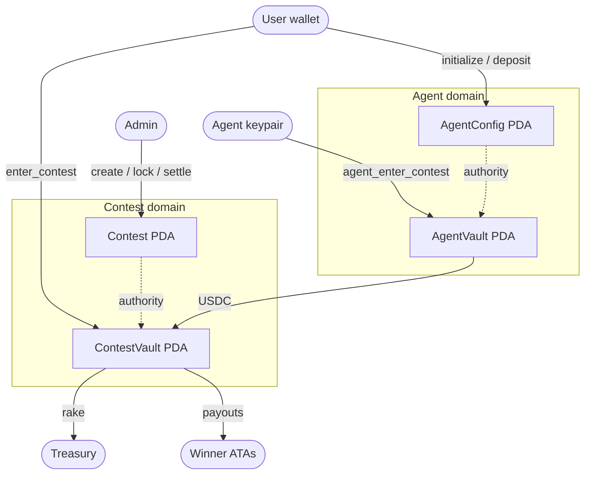

# squadxi-escrow

Solana Anchor program powering on-chain financial infrastructure for [SquadXI](https://squadxi.xyz) — a fantasy football platform with USDC-based paid contests and autonomous agent-driven entries.

---

## What it does

SquadXI lets users pay USDC to enter fantasy football contests. This program handles everything on-chain: contest creation, entry fee escrow, prize distribution, rake collection, and an autonomous agent system that lets users pre-authorize the platform to enter contests on their behalf within user-defined spending limits.

The notable architectural decision was keeping both domains — contest escrow and agent vault — in a **single unified program**. This means `agent_enter_contest` is a direct internal instruction that atomically updates contest state, creates an entry receipt, and transfers USDC between vaults without any cross-program invocation.

---

## Architecture



Solid arrows are instruction calls or USDC transfers. Dashed arrows represent PDA authority relationships — `ContestVault` and `AgentVault` are PDA token accounts whose signing authority is their respective config PDA, allowing the program to transfer out of them without an external signer.

---

## On-chain accounts

### Contest domain

| Account | Seeds | Stores |
|---|---|---|
| `Contest` | `["contest", uuid_bytes]` | authority, entry_fee, rake_bps, max_entries, entry_count, total_pool, status, deadline |
| `ContestVault` | `["vault", uuid_bytes]` | PDA token account holding entry fees; authority = Contest PDA |
| `EntryReceipt` | `["entry", uuid_bytes, user_wallet]` | user, amount_paid, refund_claimed — existence proves entry, init guard prevents double-entry |

### Agent domain

| Account | Seeds | Stores |
|---|---|---|
| `AgentConfig` | `["agent-config", user_wallet]` | agent pubkey, spending limits, weekly counter, is_active |
| `AgentVault` | `["agent-vault", user_wallet]` | PDA token account holding user deposits; authority = AgentConfig PDA |

### Global

| Account | Seeds | Stores |
|---|---|---|
| `ProgramConfig` | `["config"]` | allowed_mint, treasury, authority — runtime-configurable, no redeploy needed to switch mints |

---

## Instructions

### Contest lifecycle (admin-signed)

| Instruction | Description |
|---|---|
| `initialize_config` | One-time setup — sets allowed mint and treasury |
| `update_config` | Rotate allowed mint or treasury without redeploying |
| `create_contest` | Initialises Contest PDA and ContestVault; sets entry fee, rake, deadline |
| `lock_contest` | Closes entries; status → Locked |
| `settle_contest` | Distributes USDC to winners + rake to treasury; on-chain validation: `sum(payouts) + rake == total_pool` |
| `cancel_contest` | Sets status → Cancelled; users pull their own refunds |

### User entry (user-signed, frontend)

| Instruction | Description |
|---|---|
| `enter_contest` | Transfers entry fee to ContestVault; creates EntryReceipt PDA (init guard = AlreadyEntered protection) |
| `claim_refund` | Refunds entry fee from a cancelled contest; guarded by `refund_claimed` flag |

### Agent system (mixed signers)

| Instruction | Signer | Description |
|---|---|---|
| `initialize_agent` | user | Creates AgentConfig + AgentVault; stores platform agent pubkey |
| `deposit` | user | Transfers USDC from user wallet to AgentVault |
| `withdraw` | user | Transfers USDC from AgentVault back to user wallet |
| `activate_agent` | user | Sets `is_active = true` |
| `deactivate_agent` | user | Sets `is_active = false` — immediately stops agent spending |
| `update_agent_config` | user | Updates `max_spend_per_contest` and `max_contests_per_week` |
| `agent_enter_contest` | agent keypair | Transfers USDC from AgentVault → ContestVault; enforces spending limits; resets weekly counter lazily if 7-day window has elapsed |

---

## Key design decisions

**Unified program over two programs.** `agent_enter_contest` updates contest state, creates an `EntryReceipt`, and transfers tokens in a single instruction. With a two-program design this would require CPI with PDA-to-PDA signing. Unifying eliminates that complexity entirely.

**`EntryReceipt` as an AlreadyEntered guard.** The PDA is initialised with `init` (not `init_if_needed`). Anchor's `init` fails with `AccountAlreadyInitialized` if the PDA exists. No explicit `require!` check needed — the constraint is structural.

**Lazy weekly counter reset.** Solana programs have no scheduler. On each `agent_enter_contest` call, the handler checks whether `now - week_start > 7 days`. If so, it resets `contests_this_week` to 0 before enforcing the limit. No cron job required on-chain.

**Runtime-configurable mint via `ProgramConfig`.** Switching from devnet USDC to mainnet USDC (or adding USDT support) is a single `update_config` call. No feature flags, no redeploy.

**Settlement math validated on-chain.** `settle_contest` rejects any winner list where `sum(amounts) + rake != total_pool`. Integer arithmetic throughout — no floating point.

---

## Tech stack

- **Anchor 1.0.0** — program framework
- **Rust** — program implementation
- **SPL Token** — standard token program (non-Token-2022)
- **`anchor-bankrun`** — fast in-process TypeScript test runtime (no local validator)

---

## Local development

```bash
# Install dependencies
yarn install

# Build
anchor build

# Run tests
yarn ts-mocha -p ./tsconfig.json -t 1000000 tests/squadxi.ts
```

---

## Test suite

22 tests, ~1 second end-to-end using `anchor-bankrun` (in-process, no validator).

Settlement tests verify actual SPL token balances before and after — payout amounts and rake are checked against on-chain state, not mocked values.

| Group | Tests |
|---|---|
| Config | initialize_config, update_config |
| Contest — happy path | create, enter ×2, lock, settle with verified balances |
| Contest — cancel path | cancel, claim_refund with balance assertion |
| Agent | initialize, deposit, activate, agent_enter_contest, update_config, deactivate, withdraw |
| Errors | AlreadyEntered, ContestNotOpen, InvalidSettlement, NotAuthority, AgentNotActive, WeeklyLimitReached |

---

## Deployment

| Property | Value |
|---|---|
| Program ID | `EwTXRAQrnm4BasdA5UCabHqpeodjAES3ok8D4LCg6Xt8` |
| Network | Solana devnet |
| Allowed mint | `4zMMC9srt5Ri5X14GAgXhaHii3GnPAEERYPJgZJDncDU` (devnet USDC) |
| Explorer | [View on Solana Explorer](https://explorer.solana.com/address/EwTXRAQrnm4BasdA5UCabHqpeodjAES3ok8D4LCg6Xt8?cluster=devnet) |
